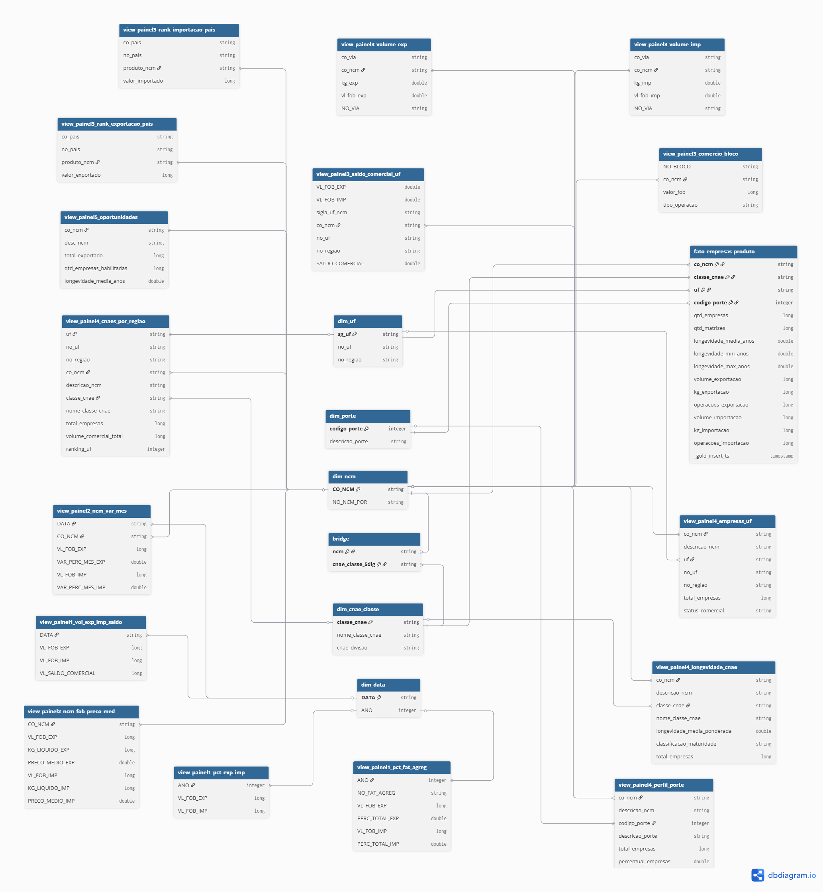

# Pipeline de Dados — Balança Comercial Brasileira & CNPJ

<p align="center">
  
  
  
  
  
</p>

---

## Sumário

- [Visão Geral](#visão-geral)
- [Arquitetura](#arquitetura)
- [Fontes de Dados](#fontes-de-dados)
- [Camada Bronze — Ingestão de Dados Brutos](#camada-bronze--ingestão-de-dados-brutos)
- [Camada Silver — Tratamento e Padronização](#camada-silver--tratamento-e-padronização)
- [Camada Gold — KPIs e Visões Analíticas](#camada-gold--kpis-e-visões-analíticas)
- [Modelagem da Camada Gold](#modelagem-da-camada-gold)
- [Segurança — Azure Key Vault](#segurança--azure-key-vault)
- [Estimativa de Custos (Azure)](#estimativa-de-custos-azure)
- [Estrutura do Repositório](#estrutura-do-repositório)
- [Melhorias Futuras](#melhorias-futuras)
- [Contribuintes](#contribuintes)

---

## Visão Geral

Este projeto implementa um **pipeline de dados end-to-end** utilizando a plataforma **Microsoft Azure** e **Azure Databricks**, seguindo a arquitetura **Medallion (Bronze → Silver → Gold)**. O objetivo é ingerir, tratar e disponibilizar dados da **Balança Comercial Brasileira** (exportações e importações) e dados cadastrais de **CNPJ** (Receita Federal) para consumo analítico via **Power BI**.

Os dados brutos originam-se de uma **landing zone** em um **Azure Blob Storage clássico** e são movidos para um **Azure Blob Storage Gen2 (ADLS Gen2)**, onde o Databricks mapeia as tabelas no **Hive Metastore** utilizando a cláusula `LOCATION`, garantindo que o dado físico permaneça no Data Lake e seja apenas referenciado pelo catálogo de metadados.

Todo o processo de **ingestão, tratamento, transformação e disponibilização** das tabelas foi desenvolvido utilizando notebooks no **Azure Databricks**, com suporte do **Delta Lake** para garantir transações ACID, versionamento de dados e performance otimizada.

### Principais Características

- **Arquitetura Medallion** (Bronze, Silver, Gold) com separação clara de responsabilidades
- **Ingestão incremental** com tabelas de controle Delta para evitar reprocessamento
- **Auto Loader (cloudFiles)** para ingestão de dados de exportação/importação com detecção automática de novos arquivos
- **Descompactação de arquivos ZIP** em runtime para dados de CNPJ
- **Mapeamento de tabelas no Hive Metastore** via cláusula `LOCATION` (ADLS Gen2)
- **Segurança com Azure Key Vault** — todas as credenciais, storage accounts e nomes de containers são armazenados como secrets
- **Merge (Upsert) via Delta Lake** para atualização controlada da tabela de controle
- **Correlação NCM ↔ CNAE** para cruzar dados de comércio exterior com o cadastro empresarial brasileiro

---

## Arquitetura

O diagrama abaixo apresenta a arquitetura completa do pipeline de dados:

<p align="center">
  
</p>

### Fluxo Geral

1. **Landing Zone (Blob Storage Clássico):** Uma API externa atualiza mensalmente os dados brutos de balança comercial e CNPJ em um Azure Blob Storage clássico.
2. **Endpoint (Key Vault):** O Databricks acessa as credenciais de forma segura via Azure Key Vault (`acelera-grupo-5-kv`).
3. **Bronze (Raw Integration):** Dados são ingeridos no ADLS Gen2 em formato Delta, com metadados de controle (`_ingestion_date`, `_ingestion_timestamp`, `_source_path`).
4. **Silver (Filtered, Cleaned, Augmented):** Os dados passam por tipagem, renomeação, deduplicação, tratamento de nulos e padronização.
5. **Gold (Business-Level Aggregates):** KPIs e views analíticas são gerados para consumo direto por dashboards.
6. **SQL Warehouse:** O Databricks SQL Warehouse expõe as tabelas Gold para conexão com o Power BI.
7. **Power BI Service:** Dashboards, relatórios e datasets são servidos aos usuários finais.

### Stack de Tecnologias

| Componente | Tecnologia |
|---|---|
| Nuvem | Microsoft Azure |
| Processamento | Azure Databricks (PySpark + Spark SQL) |
| Armazenamento | Azure Data Lake Storage Gen2 (ADLS Gen2) |
| Formato de Dados | Delta Lake |
| Orquestração | Lakeflow Jobs (Databricks Workflows) |
| Segurança | Azure Key Vault |
| Catálogo de Dados | Hive Metastore |
| Visualização | Power BI Service |
| Versionamento | GitHub |
| Gestão de Projetos | Microsoft Planner |

---

## Fontes de Dados

### 1. Balança Comercial Brasileira
Dados públicos do **Ministério do Desenvolvimento, Indústria, Comércio e Serviços (MDIC)** contendo informações detalhadas sobre exportações e importações do Brasil, incluindo:
- **Fatos:** `EXP_YYYY.csv` (exportações por ano), `IMP_YYYY.csv` (importações por ano), `EXP_YYYY_MUN.csv` (exportações por município), `IMP_YYYY_MUN.csv` (importações por município)
- **Dimensões:** País, Via de Transporte, URF, UF, Município, NCM, NCM SH, NCM CGCE, NCM CUCI, NCM ISIC, NBM, NBM-NCM, Fator Agregado, PPE, PPI, Bloco Econômico, Unidade

### 2. Cadastro Nacional da Pessoa Jurídica (CNPJ)
Dados abertos da **Receita Federal do Brasil** contendo o cadastro completo de empresas, disponibilizados em arquivos `.zip` contendo CSVs com separador `;` e encoding `ISO-8859-1`:
- **Tabelas:** Empresas, Estabelecimentos, Sócios, Simples/MEI, CNAEs, Municípios, Naturezas Jurídicas, Países, Qualificações, Motivos

### 3. Correlação NCM ↔ CNAE
Tabela de correspondência entre códigos **NCM** (Nomenclatura Comum do MERCOSUL) e **CNAE** (Classificação Nacional de Atividades Econômicas), permitindo cruzar dados de comércio exterior com o perfil empresarial brasileiro. Origem em arquivos Excel (`.xls` / `.xlsx`), onde cada NCM pode estar associado a múltiplos CNAEs (separados por `;`), resultando em uma relação **N:N** (bridge table).

---

## Camada Bronze — Ingestão de Dados Brutos

A camada Bronze é responsável pela **ingestão dos dados brutos** (raw) da landing zone para o ADLS Gen2 no formato Delta, preservando os dados originais e adicionando metadados de controle de ingestão.

### Notebooks

| Notebook | Descrição |
|---|---|
| `bronze_main.ipynb` | Orquestrador principal — executa sequencialmente os notebooks de ingestão via `%run` |
| `containers.ipynb` | Classe `AzureContainer` para abstração de acesso ao Azure Blob Storage (listagem e leitura de arquivos) |
| `intancia_containers.ipynb` | Instancia os containers de origem (BALANCE e CNPJ), cria inventário de arquivos e inicializa a tabela de controle Delta |
| `colunas_cnpj.ipynb` | Dicionário de mapeamento de colunas para cada tabela de CNPJ da Receita Federal (10 tabelas) |
| `ingestao_cnpj.ipynb` | Ingestão incremental dos dados de CNPJ — descompacta ZIPs, renomeia colunas, grava em Delta particionado por `_ingestion_date` |
| `ingestao_dim_balance.ipynb` | Ingestão incremental das tabelas dimensionais da balança comercial (CSVs — exclui fatos EXP/IMP) |
| `ingestao_fact_balance.ipynb` | Ingestão das tabelas fato (EXP, IMP, EXP_MUN, IMP_MUN) via **Auto Loader** (`cloudFiles`) com trigger `once=True` |
| `bronze_corr_ncm_cnae.ipynb` | Ingestão da tabela de correlação NCM ↔ CNAE a partir de arquivos Excel, com `explode` dos CNAEs separados por `;` |

### Destaques Técnicos — Bronze

- **Tabela de Controle Incremental:** Uma tabela Delta (`control_table`) é utilizada para registrar o timestamp da última ingestão de cada arquivo. Antes de processar, o pipeline compara o `modificationTime` dos arquivos da origem com o `last_ingestion_timestamp` da tabela de controle, processando apenas arquivos novos ou modificados.
- **Merge (Upsert):** A atualização da tabela de controle é feita via `DeltaTable.merge()`, garantindo idempotência:
  ```python
  dt.alias("target").merge(
      controle_df.alias("source"),
      "target.originator = source.originator AND target.table_name = source.table_name"
  ).whenMatchedUpdateAll().whenNotMatchedInsertAll().execute()
  ```
- **Auto Loader para Fatos:** As tabelas de exportação e importação utilizam o `Structured Streaming` com formato `cloudFiles` para detecção automática de novos arquivos, com checkpoint persistente e schema inference:
  ```python
  spark.readStream
      .format("cloudFiles")
      .option("cloudFiles.format", "csv")
      .option("pathGlobFilter", "EXP_[0-9][0-9][0-9][0-9].csv")
      .option("cloudFiles.includeExistingFiles", "true")
      .load(LANDING_PATH)
      .writeStream.format("delta").trigger(once=True)
      .start(f"{BRONZE_PATH}/exp")
  ```
- **Descompactação em Runtime:** Os arquivos ZIP de CNPJ são copiados para o DBFS local (`/dbfs/tmp/`), extraídos com `zipfile`, e os CSVs resultantes são lidos com Spark.
- **Metadados de Controle:** Toda tabela Bronze inclui colunas de rastreabilidade:
  - `_ingestion_date` — Data da ingestão (usado para particionamento)
  - `_ingestion_timestamp` — Timestamp exato da ingestão (usado para controle incremental)
  - `_source_path` — Caminho completo do arquivo de origem
- **Classe `AzureContainer`:** Encapsula o acesso aos containers Azure, fornecendo métodos `list_files()` e `get_files_list()` para abstração e reuso.

---

## Camada Silver — Tratamento e Padronização

A camada Silver aplica as transformações de **limpeza, tipagem, deduplicação e padronização** sobre os dados brutos da Bronze, tornando-os prontos para consumo analítico.

### Notebooks

| Notebook | Descrição |
|---|---|
| `silver_main.ipynb` | Orquestrador — executa `silver_balanca` e `silver_cnpj` via `%run` |
| `silver_balanca.ipynb` | Transformação de todas as tabelas da Balança Comercial (18+ tabelas entre dimensões e fatos) |
| `silver_cnpj.ipynb` | Transformação de todas as tabelas de CNPJ da Receita Federal (10 tabelas) |

### Destaques Técnicos — Silver

- **Lógica Declarativa de Transformação:** Cada tabela é descrita por um dicionário de configuração (`table_config`) que define:
  - Tabela Bronze de origem e tabela Silver de destino
  - Colunas-chave para deduplicação (PK)
  - Mapeamento de colunas: renomeação, cast de tipo e aplicação de `trim`
  - Particionamento (quando aplicável, ex: `uf` para Estabelecimentos)
  - Descrição textual da tabela

  Exemplo:
  ```python
  {
      "bronze_table": "empresas",
      "silver_table": "empresas",
      "key_columns": ["cnpj_basico"],
      "column_mapping": {
          "cnpj_basico": {"rename": "cnpj_basico", "cast": "string", "trim": False},
          "razao_social": {"rename": "razao_social", "cast": "string", "trim": True},
          "capital_social": {"rename": "capital_social", "cast": "decimal(18,2)", "trim": False},
          ...
      },
      "partition_by": None,
      "description": "Dados cadastrais das empresas"
  }
  ```

- **Processamento Incremental:** A Silver possui sua própria tabela de controle (`metadata.silver_control_cnpj` e `metadata.silver_control_balanca`), garantindo que apenas registros novos (baseados em `_ingestion_timestamp`) sejam processados.

- **Deduplicação por Chave Primária:** Após a transformação de colunas, os registros duplicados são removidos com base nas `key_columns` definidas na configuração, mantendo sempre a versão mais recente.

- **Otimizações Spark:** O pipeline configura otimizações importantes no momento da execução:
  ```python
  spark.conf.set("spark.databricks.delta.optimizeWrite.enabled", "true")
  spark.conf.set("spark.databricks.delta.autoCompact.enabled", "true")
  spark.conf.set("spark.databricks.delta.schema.autoMerge.enabled", "true")
  spark.conf.set("spark.sql.adaptive.enabled", "true")
  spark.conf.set("spark.sql.adaptive.coalescePartitions.enabled", "true")
  ```

- **Registro no Hive Metastore:** Todas as tabelas Silver são registradas no Hive Metastore com `CREATE TABLE ... USING DELTA LOCATION '...'`, permitindo acesso via Spark SQL (`hive_metastore.silver.<tabela>`).

### Tabelas Silver

#### Balança Comercial (18 tabelas)
| Tabela | Tipo | Descrição |
|---|---|---|
| `pais` | Dimensão | Cadastro de países (código, nome PT/EN/ES, ISO) |
| `via` | Dimensão | Vias de transporte (marítima, aérea, rodoviária, etc.) |
| `urf` | Dimensão | Unidades da Receita Federal |
| `uf` | Dimensão | Unidades Federativas com região |
| `uf_mun` | Dimensão | Municípios com UF |
| `ncm` | Dimensão | Nomenclatura Comum do MERCOSUL |
| `ncm_sh` | Dimensão | Sistema Harmonizado (SH2, SH4, SH6) |
| `ncm_cgce` | Dimensão | Classificação por Grandes Categorias Econômicas |
| `ncm_cuci` | Dimensão | Classificação Uniforme para Comércio Internacional |
| `ncm_isic` | Dimensão | Classificação Internacional de Atividades Econômicas |
| `ncm_fat_agreg` | Dimensão | Fator de Agregação (grau de industrialização) |
| `ncm_unidade` | Dimensão | Unidades de medida |
| `ncm_ppe` / `ncm_ppi` | Dimensão | Pauta de Produtos (Exportação / Importação) |
| `nbm` / `nbm_ncm` | Dimensão | Nomenclatura Brasileira de Mercadorias |
| `isic_cuci` | Dimensão | Correspondência ISIC ↔ CUCI |
| `pais_bloco` | Dimensão | Países por Bloco Econômico |
| `exp` / `imp` | Fato | Exportações e importações por NCM, país, UF, via |
| `exp_mun` / `imp_mun` | Fato | Exportações e importações por município (maior granularidade) |

#### CNPJ (10 tabelas)
| Tabela | Tipo | Descrição |
|---|---|---|
| `empresas` | Dimensão | Dados cadastrais (razão social, capital social, porte) |
| `estabelecimentos` | Dimensão | Endereço, CNAE, situação cadastral (particionado por UF) |
| `socios` | Dimensão | Quadro societário das empresas |
| `simples` | Dimensão | Opção pelo Simples Nacional e MEI |
| `cnaes` | Dimensão | Classificação Nacional de Atividades Econômicas |
| `municipios` | Dimensão | Cadastro de municípios |
| `naturezas` | Dimensão | Naturezas jurídicas |
| `paises` | Dimensão | Cadastro de países |
| `qualificacoes` | Dimensão | Qualificações de sócios |
| `motivos` | Dimensão | Motivos de situação cadastral |

#### Correlação NCM ↔ CNAE (Bridge)
| Tabela | Tipo | Descrição |
|---|---|---|
| `corr_ncm_cnae` | Bridge | Correspondência N:N entre NCM e CNAE |

---

## Camada Gold — KPIs e Visões Analíticas

A camada Gold é responsável por gerar as **views e tabelas agregadas** que alimentam os dashboards do Power BI. Cada view é persistida como tabela Delta no ADLS Gen2 e registrada no Hive Metastore (`gold.<nome_tabela>`) via a função utilitária `salva_tabela()`:

```python
def salva_tabela(df, nome_tabela, PATH):
    df.write.format("delta").mode("overwrite").save(PATH + nome_tabela)
    spark.sql(f"""
        CREATE TABLE IF NOT EXISTS gold.{nome_tabela}
        USING DELTA
        LOCATION '{PATH}{nome_tabela}'
    """)
```

### Tabelas Auxiliares (Dimensões Gold)

| Tabela Gold | Descrição |
|---|---|
| `dim_ncm` | Dimensão NCM com código e descrição em português (`CO_NCM`, `NO_NCM_POR`) |
| `dim_data` | Dimensão temporal com `ANO`, `MES` e coluna `DATA` no formato `yyyy-MM-dd` |

---

### Painel 1 — Visão Macro da Balança Comercial

#### KPI 1 & 2: Volume Total de Exportações e Importações (USD FOB) + Evolução do Saldo Comercial

**Tabela:** `view_painel1_vol_exp_imp_saldo`

- Agrega o valor FOB de exportações e importações por **ano e mês**
- Calcula o **saldo comercial** (superávit/déficit): `VL_SALDO_COMERCIAL = VL_FOB_EXP - VL_FOB_IMP`
- Gera coluna `DATA` no formato padrão para uso em gráficos de linha temporal
- Permite visualizar a evolução mensal da balança comercial, identificando períodos de superávit e déficit

| Coluna | Descrição |
|---|---|
| `DATA` | Data no formato `yyyy-MM-01` (primeiro dia do mês) |
| `VL_FOB_EXP` | Volume total de exportações em USD FOB no período |
| `VL_FOB_IMP` | Volume total de importações em USD FOB no período |
| `VL_SALDO_COMERCIAL` | Saldo comercial (exportação − importação) |

#### KPI 3: Participação Relativa — Exportação vs Importação (%) por Ano

**Tabela:** `view_painel1_pct_exp_imp`

- Agrupa os valores totais de exportação e importação por **ano**
- Permite calcular a participação percentual de cada operação no comércio total

| Coluna | Descrição |
|---|---|
| `ANO` | Ano de referência |
| `VL_FOB_EXP` | Total exportado no ano (USD FOB) |
| `VL_FOB_IMP` | Total importado no ano (USD FOB) |

#### KPI 4: Distribuição por Grau de Industrialização (Fator Agregado)

**Tabela:** `view_painel1_pct_fat_agreg`

- Cruza os dados de exportação/importação com a dimensão **NCM → Fator Agregado** para classificar os produtos pelo grau de industrialização (ex: Básicos, Semimanufaturados, Manufaturados, Operações Especiais)
- Calcula o **percentual de participação** de cada fator sobre o total geral, tanto para exportação quanto importação
- Utiliza `Window Functions` para cálculo do total geral

| Coluna | Descrição |
|---|---|
| `ANO` | Ano de referência |
| `NO_FAT_AGREG` | Fator de agregação (grau de industrialização) |
| `VL_FOB_EXP` | Valor exportado (USD FOB) |
| `PERC_TOTAL_EXP` | Participação (%) sobre o total de exportações |
| `VL_FOB_IMP` | Valor importado (USD FOB) |
| `PERC_TOTAL_IMP` | Participação (%) sobre o total de importações |

---

### Painel 2 — Análise por Produto (NCM)

#### KPI 1 & 2: NCMs mais Exportados/Importados + Volume × Preço Médio por Produto

**Tabela:** `view_painel2_ncm_fob_preco_med`

- Agrega exportações e importações por **código NCM**
- Calcula o **preço médio** (valor FOB / peso líquido em KG) para cada NCM, tanto para exportação quanto importação
- Permite identificar produtos com alto valor agregado (preço médio elevado) vs commodities (alto volume, baixo preço)

| Coluna | Descrição |
|---|---|
| `CO_NCM` | Código NCM do produto |
| `VL_FOB_EXP` | Total exportado (USD FOB) |
| `KG_LIQUIDO_EXP` | Peso líquido exportado (KG) |
| `PRECO_MEDIO_EXP` | Preço médio de exportação (USD/KG) |
| `VL_FOB_IMP` | Total importado (USD FOB) |
| `KG_LIQUIDO_IMP` | Peso líquido importado (KG) |
| `PRECO_MEDIO_IMP` | Preço médio de importação (USD/KG) |

#### KPI 3: Variação Percentual de Produtos Mês a Mês

**Tabela:** `view_painel2_ncm_var_mes`

- Calcula a **variação percentual mensal** (`MoM %`) do valor FOB de cada NCM, tanto para exportação quanto importação
- Utiliza `Window Functions` com `lag()` para comparar com o mês anterior dentro de cada produto
- Permite identificar tendências de crescimento ou queda na demanda por produto

| Coluna | Descrição |
|---|---|
| `DATA` | Data de referência (`yyyy-MM-01`) |
| `CO_NCM` | Código NCM |
| `VL_FOB_EXP` | Valor FOB de exportação |
| `VAR_PERC_MES_EXP` | Variação % mensal de exportação |
| `VL_FOB_IMP` | Valor FOB de importação |
| `VAR_PERC_MES_IMP` | Variação % mensal de importação |

#### Filtro: Top 10 Produtos

O pipeline seleciona automaticamente os **10 produtos (NCM) mais relevantes** utilizando um algoritmo de ranking que prioriza:
1. Top 5 produtos mais exportados (por VL_FOB)
2. Top 5 produtos mais importados (por VL_FOB)
3. Remoção de duplicatas (produtos que aparecem em ambas as listas)
4. Preenchimento com extras das listas de exportação e importação até completar 10

Os NCMs selecionados no Top 10 são:

| NCM | Descrição |
|---|---|
| `02023000` | Carnes desossadas de bovino, congeladas |
| `12019000` | Soja, mesmo triturada (exceto para semeadura) |
| `17011400` | Açúcar de cana |
| `26011100` | Minérios de ferro e seus concentrados (não aglomerados) |
| `27011200` | Hulha betuminosa |
| `27090010` | Óleos brutos de petróleo |
| `27101921` | Gasóleo (óleo diesel) |
| `31042090` | Cloreto de potássio |
| `84119100` | Partes de turborreatores ou de turbopropulsores |
| `09011110` | Café não torrado, não descafeinado, em grão |

---

### Painel 3 — Análise Geográfica e Logística

#### Top 10 Países em Exportação e Importação (por produto)

**Tabelas:** `view_painel3_rank_exportacao_pais` e `view_painel3_rank_importacao_pais`

- Para cada produto do Top 10, lista os países de destino (exportação) e origem (importação) com os respectivos valores FOB
- Permite identificar os principais parceiros comerciais do Brasil para cada produto

| Coluna | Descrição |
|---|---|
| `NO_PAIS` | Nome do país |
| `PRODUTO_NCM` | Código NCM do produto |
| `VALOR_EXPORTADO` / `VALOR_IMPORTADO` | Valor total (USD FOB) |

#### Exportação e Importação por Bloco Econômico

**Tabela:** `view_painel3_comercio_bloco`

- Agrega o comércio (exportação + importação) por **bloco econômico** (MERCOSUL, União Europeia, NAFTA, etc.) e código NCM
- Utiliza `unionByName` para unificar exportação e importação em uma única tabela com coluna `tipo_operacao`

| Coluna | Descrição |
|---|---|
| `NO_BLOCO` | Nome do bloco econômico |
| `CO_NCM` | Código NCM |
| `VALOR_FOB` | Valor comercializado (USD FOB) |
| `TIPO_OPERACAO` | `EXPORTACAO` ou `IMPORTACAO` |

#### Saldo Comercial por UF

**Tabela:** `view_painel3_saldo_comercial_uf`

- Calcula exportação, importação e **saldo comercial** (superávit/déficit) por **Unidade Federativa** e NCM
- Enriquece com nome da UF e nome da região para uso em mapas no Power BI

| Coluna | Descrição |
|---|---|
| `SIGLA_UF_NCM` | Sigla da UF |
| `CO_NCM` | Código NCM |
| `NO_UF` | Nome da UF |
| `NO_REGIAO` | Região do Brasil |
| `VL_FOB_EXP` | Total exportado pela UF (USD FOB) |
| `VL_FOB_IMP` | Total importado pela UF (USD FOB) |
| `SALDO_COMERCIAL` | Exportação − Importação |

#### Volume de Exportação e Importação por Via de Transporte

**Tabelas:** `view_painel3_volume_exp` e `view_painel3_volume_imp`

- Agrega o volume (KG líquido) e valor (USD FOB) por **via de transporte** (marítima, aérea, rodoviária, etc.) e NCM
- Permite analisar a distribuição logística dos principais produtos comercializados

| Coluna | Descrição |
|---|---|
| `CO_VIA` | Código da via |
| `CO_NCM` | Código NCM |
| `KG_EXP` / `KG_IMP` | Peso líquido (KG) |
| `VL_FOB_EXP` / `VL_FOB_IMP` | Valor FOB (USD) |
| `NO_VIA` | Nome da via de transporte |

---

### Painel 4 — Inteligência Empresarial (CNPJ + Balança Comercial)

Este painel é o mais sofisticado do projeto. Ele cruza dados de comércio exterior com o **cadastro empresarial brasileiro (CNPJ)** através da tabela bridge **NCM ↔ CNAE**, permitindo entender o perfil das empresas que atuam nos setores dos produtos mais comercializados.

#### Dimensões e Views para o Power BI

| Tabela Gold | Descrição |
|---|---|
| `view_painel4_dim_ncm_top10` | Dimensão NCM filtrada pelo Top 10, com descrição |
| `view_painel4_bridge_top10` | Bridge NCM ↔ CNAE filtrada pelo Top 10 |
| `view_painel4_empresas_uf` | Total de empresas, matrizes e longevidade média por CNAE × UF |
| `view_painel4_perfil_porte` | Distribuição de empresas por CNAE × porte (Microempresa, EPP, Demais) |
| `view_painel4_cnaes_por_regiao` | Top 10 CNAEs por região, com ranking, longevidade e total de empresas |
| `view_painel4_longevidade_cnae` | Longevidade média por CNAE com classificação de maturidade setorial |

#### Classificação de Maturidade Setorial

A tabela `view_painel4_longevidade_cnae` classifica os setores em 4 categorias baseadas na **longevidade média** das empresas:

| Classificação | Faixa |
|---|---|
| Setor Maduro | 20+ anos |
| Setor Estabelecido | 10-20 anos |
| Setor Emergente | 5-10 anos |
| Setor Novo | < 5 anos |

#### Métricas Detalhadas (Fato Temporária `tmp_fato_empresas_top10`)

A CTE principal do Painel 4 (`tmp_fato_empresas_top10`) cruza dados de:
- **Bridge NCM ↔ CNAE** (quais CNAEs fabricam/comercializam os produtos Top 10)
- **Estabelecimentos + Empresas** (apenas situação cadastral = 2 → Ativas)
- **Exportações e Importações** (volume, peso, quantidade de operações)

Métricas geradas:
| Métrica | Descrição |
|---|---|
| `qtd_empresas` | Quantidade de empresas ativas por CNAE × UF × porte |
| `qtd_matrizes` | Quantidade de matrizes (identificador_matriz_filial = 1) |
| `longevidade_media_anos` | Média de anos desde a data de início de atividade |
| `longevidade_min_anos` / `longevidade_max_anos` | Menor e maior longevidade |
| `volume_exportacao` / `volume_importacao` | Valores FOB |
| `kg_exportacao` / `kg_importacao` | Peso em KG |
| `operacoes_exportacao` / `operacoes_importacao` | Contagem de operações |

---

### Painel 5 — Oportunidades de Mercado

**Tabela:** `view_painel5_oportunidades`

Este painel identifica **oportunidades de mercado** cruzando os produtos mais exportados com as empresas habilitadas por CNAE no Brasil.

**Fluxo de processamento:**
1. **Recuperação de valores:** O Top 10 NCM é cruzado com os dados de exportação para obter o `vl_fob_recuperado`
2. **Bridge NCM → CNAE:** Os NCMs são cruzados com a tabela `corr_ncm_cnae` para descobrir quais CNAEs estão associados
3. **CNAE → Empresas:** Os CNAEs são cruzados com `estabelecimentos` + `empresas`, filtrando apenas empresas **ativas** (`situacao_cadastral = 2`)
4. **Agregação final:** Gera métricas de inteligência de mercado

| Coluna | Descrição |
|---|---|
| `DESC_NCM` | Descrição do produto (NCM) |
| `TOTAL_EXPORTADO` | Valor total exportado (USD FOB) |
| `QTD_EMPRESAS_HABILITADAS` | Quantidade de empresas ativas que atuam no CNAE correspondente |
| `LONGEVIDADE_MEDIA_ANOS` | Longevidade média das empresas habilitadas (em anos) |

#### Data Quality — Auditoria da Bridge NCM ↔ CNAE

O notebook também inclui uma **auditoria de qualidade** da tabela bridge, verificando:
- **Cobertura de Catálogo:** Percentual de NCMs distintos nas exportações que possuem correspondência na bridge
- **Cobertura de Valor FOB:** Percentual do valor total exportado que está coberto pela bridge (critério de sucesso: > 60%)
- **Complexidade da Modelagem:** Média de CNAEs por NCM (fator N:N)

---

## Modelagem da Camada Gold

A imagem abaixo apresenta a **modelagem dimensional** utilizada na camada Gold para otimizar o consumo dos dados no Power BI:

<p align="center">
  
</p>

---

## Segurança — Azure Key Vault

O projeto adota boas práticas de segurança através do **Azure Key Vault** (`acelera-grupo-5-kv`), utilizado em todo o pipeline para armazenar e recuperar credenciais de forma segura. Nenhuma credencial, nome de storage account ou nome de container é hardcoded no código.

### Secrets Utilizados

| Secret Key | Descrição |
|---|---|
| `src-storage-account` | Nome do Storage Account de origem (landing zone) |
| `src-balance-container` | Nome do container com dados da Balança Comercial |
| `src-cnpj-container` | Nome do container com dados de CNPJ |
| `tgt-storage-account` | Nome do Storage Account de destino (ADLS Gen2) |
| `tgt-bronze-container` | Nome do container Bronze |

### Exemplo de Uso no Código

```python
# Recuperando credenciais do Key Vault
SRC_STORAGE_ACCOUNT = dbutils.secrets.get(scope="acelera-grupo-5-kv", key="src-storage-account")
TGT_STORAGE_ACCOUNT = dbutils.secrets.get(scope="acelera-grupo-5-kv", key="tgt-storage-account")
```

A autenticação do Databricks com o Storage Account é configurada diretamente no **cluster** via Service Principal ou Managed Identity, com a role `Storage Blob Data Contributor` atribuída ao recurso.

---

## Estimativa de Custos (Azure)

Abaixo estão os custos mensais estimados da infraestrutura Azure utilizada no projeto. Todos os recursos foram provisionados na região **East US**, com o modelo de pagamento **PAGO CONFORME O USO** sob o **Microsoft Customer Agreement (MCA)**.

| Categoria | Serviço | Descrição | Custo Mensal Estimado |
|---|---|---|---|
| **Armazenamento** | Storage Accounts (Data Lake Store Gen2) | Redundância Padrão LRS, Quente, Namespace hierárquico, Capacidade 1.000 GB, operações de gravação: 4 MB × 10 ops, leitura: 4 MB × 10 ops, leitura iterativa: 10 ops, 100.000 leitura de prioridade alta, gravação iterativa: 10 ops, 10 outras operações. 1.000 GB Recuperação de Dados, 1.000 GB Recuperação de prioridade alta, 1.000 GB Gravação de Dados, 1.000 GB Armazenamento de metadados | R$ 273,82 |
| **Análises** | Azure Databricks (Computação) | Carga de trabalho Computação para Todas as Finalidades, camada Padrão, 3 D4AV4 (4 vCPU(s), 16 GB de RAM) × 64 Horas, 0.75 DBU × 64 Horas | R$ 492,18 |
| **Análises** | Azure Databricks (SQL Serverless) | Carga de trabalho SQL sem servidor, camada Premium, 1 2X-Pequeno cluster × 4 DBU por cluster × 2 Horas | R$ 29,18 |
| **Segurança** | Key Vault | Cofre: 10.000 operações, 0 operações avançadas, 0 renovações, 0 chaves protegidas, 0 chaves protegidas avançadas; Pools de HSM Gerenciado: 0 Pools HSM B1 Standard × 730 Horas | R$ 0,16 |
| **Rede** | Azure NAT Gateway | Camada Standard, Gateway da NAT criado com e 730 Horas de 0 GB dados processados | R$ 171,16 |
| **Support** | Support | — | R$ 0,00 |
| | | **Total Mensal Estimado** | **R$ 966,48** |
| | | **Custo Inicial (Upfront)** | **R$ 0,00** |

> **Nota:** Os valores acima são estimativas baseadas na calculadora de preços do Azure e podem variar conforme o consumo real e a região selecionada.

---

## Estrutura do Repositório

```
projeto-integrado-hexa-data/
├── README.md                              # Documentação do projeto
├── LICENSE                                # Licença do repositório
├── arquitetura.png                        # Diagrama de arquitetura
├── calculator.png                         # Estimativa de custos Azure
├── docs/
│   └── modelagem.png                      # Modelagem dimensional da camada Gold
└── src/
    ├── bronze/
    │   ├── bronze_main.ipynb              # Orquestrador da camada Bronze
    │   ├── containers.ipynb               # Classe AzureContainer (acesso ao Blob)
    │   ├── intancia_containers.ipynb      # Instanciação de containers e tabela de controle
    │   ├── colunas_cnpj.ipynb             # Dicionário de colunas CNPJ
    │   ├── ingestao_cnpj.ipynb            # Ingestão incremental de CNPJ
    │   ├── ingestao_dim_balance.ipynb     # Ingestão de dimensões da Balança Comercial
    │   ├── ingestao_fact_balance.ipynb    # Ingestão de fatos via Auto Loader
    │   └── bronze_corr_ncm_cnae.ipynb     # Ingestão da correlação NCM ↔ CNAE
    ├── silver/
    │   ├── silver_main.ipynb              # Orquestrador da camada Silver
    │   ├── silver_balanca.ipynb           # Transformação da Balança Comercial
    │   └── silver_cnpj.ipynb              # Transformação do CNPJ
    └── gold/
        └── gold_main.ipynb                # KPIs e views analíticas para Power BI
```

---

## Melhorias Futuras

### Melhorias de Código e Arquitetura

1. **Modularização em classes Python:**
   - Extrair a lógica de transformação da Silver para classes reutilizáveis (`SilverTransformer`) empacotadas como um módulo `.whl` no Databricks, eliminando a dependência de `%run` e facilitando testes unitários.

2. **Unity Catalog:**
   - Migrar do Hive Metastore para o Unity Catalog do Databricks para obter governança de dados centralizada, linhagem automática, controle de acesso granular (row/column-level) e compartilhamento entre workspaces.

3. **Parametrização via Widgets:**
   - Utilizar `dbutils.widgets` para tornar os notebooks parametrizáveis (ex: `data_inicio`, `data_fim`, `modo_execucao`), facilitando reprocessamento e execução manual controlada.

4. **Testes de Qualidade com Great Expectations / DLT Expectations:**
   - Implementar validações de qualidade declarativas diretamente nos notebooks ou via Delta Live Tables (DLT), como: registros com chave nula, valores fora de range, duplicatas, etc.

5. **Orquestração com Databricks Workflows (Lakeflow Jobs):**
   - Substituir os `%run` sequenciais por uma orquestração via Databricks Workflows com DAGs, permitindo paralelismo entre tasks independentes, retries automáticos e monitoramento centralizado.

6. **Schema Evolution explícita:**
   - Implementar versionamento de schema das tabelas Delta com alertas quando novos campos forem detectados na origem, em vez de depender apenas do `schema.autoMerge`.

7. **Logging e Observabilidade:**
   - Adicionar logging estruturado (ex: com `structlog`) e métricas de pipeline (total de registros processados, duração, erros) persistidas em uma tabela `metadata.pipeline_logs` para auditoria e dashboards operacionais.

8. **Tratamento de Erros Resiliente:**
   - Implementar Dead Letter Queue (DLQ) para registros que falham na transformação, evitando que erros em registros individuais interrompam o pipeline inteiro.

9. **Otimização de Particionamento:**
   - Avaliar o uso de `ZORDER BY` nas tabelas Delta mais consultadas (ex: fatos por `CO_NCM`, `ANO`) para otimizar queries analíticas no SQL Warehouse e Power BI.

10. **CI/CD com Databricks Asset Bundles (DABs):**
    - Implementar deploy automatizado dos notebooks, jobs e configurações de cluster via Databricks Asset Bundles integrado ao GitHub Actions.

---

## Contribuintes

<table>
  <tr>
    <td align="center">
      <a href="https://www.linkedin.com/in/araujoeleniroliveira/">
        <sub><b>Elenir Araújo Oliveira</b></sub>
      </a>
    </td>
    <td align="center">
      <a href="https://www.linkedin.com/in/kevin-carvalho-/">
        <sub><b>Kevin Carvalho</b></sub>
      </a>
    </td>
    <td align="center">
      <a href="https://www.linkedin.com/in/isabela-marim-85b88418b/">
        <sub><b>Isabela Marim</b></sub>
      </a>
    </td>
    <td align="center">
      <a href="https://www.linkedin.com/in/matheus-diogo/">
        <sub><b>Matheus Diôgo</b></sub>
      </a>
    </td>
    <td align="center">
      <a href="https://www.linkedin.com/in/viniciustorresg/">
        <sub><b>Vinicius Torres</b></sub>
      </a>
    </td>
    <td align="center">
      <a href="https://www.linkedin.com/in/jadeson-silva/">
        <sub><b>Jadeson Albuquerque</b></sub>
      </a>
    </td>
  </tr>
</table>

---

<p align="center">
  Desenvolvido com 💙 pelo <b>Grupo 5 — Acelera Hexa Data</b>
</p>
